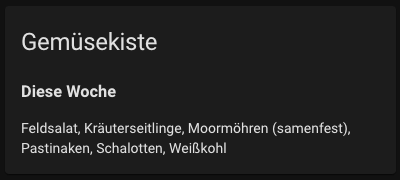
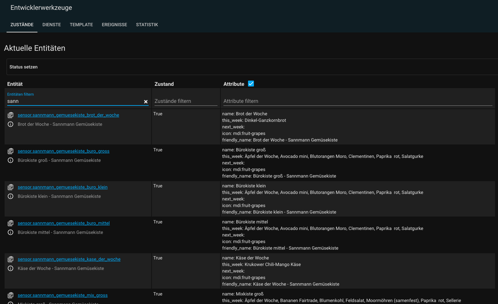

# View Sannmann Gemüsekisten Weekly Content in Homeassistant

... work in progress ...

## Install

1. Clone
2. Copy ```custom_components/sannmann_gemuese``` into ```config/custom_components/```
3. Add ```sannmann_gemuese:``` into ```config/configuration.yaml```
4. Restart Homeassistant

## Dashboard

Example card:

```yaml
type: markdown
title: Gemüsekiste
content: >-
  
    ### Diese Woche
    {{ state_attr('sensor.sannmann_gemuesekiste_regional_mittel', 'this_week') }}
  

  
    ### Nächste Woche
    {{ state_attr('sensor.sannmann_gemuesekiste_regional_mittel', 'next_week') }}
  
```



